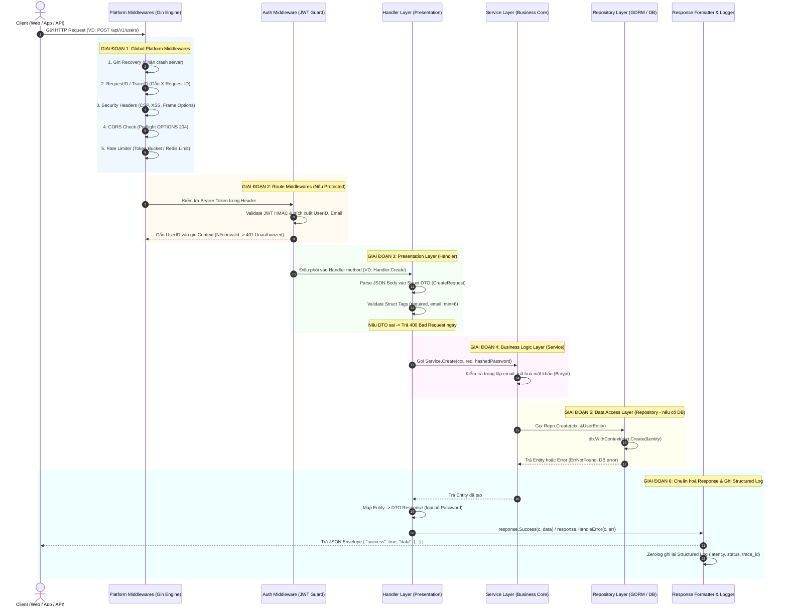

# TÀI LIỆU LUỒNG XỬ LÝ REQUEST (END-TO-END REQUEST LIFECYCLE)

> **Dự án:** CodebaseGo  
> **Kiến trúc:** Modular Monolith + Clean Layered Architecture  
> **Framework & Libs:** Gin Engine, Zerolog, GORM, Google Wire, JWT  

---

## 1. TỔNG QUAN LUỒNG XỬ LÝ (OVERVIEW)

Khi một HTTP Request từ Client (Web Frontend, Mobile App, Postman hoặc Third-Party Service) đi vào hệ thống **CodebaseGo**, nó sẽ đi qua một quy trình xử lý khép kín gồm **6 giai đoạn** nghiêm ngặt:



---

## 2. CHI TIẾT 6 GIAI ĐOẠN XỬ LÝ

### Giai đoạn 1: Chuỗi Global Middleware (Platform Layer)
**Vị trí mã nguồn:** `internal/platform/server/server.go`

Mọi HTTP request khi tới cổng server (Port 8080) sẽ lần lượt đi qua các middleware toàn cục:
1. **`gin.Recovery()`:** Bắt mọi ngoại lệ hoặc `panic` không lường trước để bảo vệ server luôn hoạt động ổn định (trả về lỗi `500 Internal Server Error` thay vì làm sập tiến trình).
2. **`requestID()`:** 
   - Kiểm tra xem Client có gửi header `X-Request-ID` hay không.
   - Nếu không có, tự động sinh mã UUID ngẫu nhiên.
   - Đưa `trace_id` vào `c.Request.Context()` và gắn ngược vào header phản hồi `X-Request-ID`.
3. **`securityHeaders()`:** Bổ sung các header bảo vệ: `X-Frame-Options: DENY`, `X-Content-Type-Options: nosniff`, `X-XSS-Protection: 1; mode=block`.
4. **`cors()`:**
   - Xử lý các yêu cầu Cross-Origin.
   - Với preflight request `OPTIONS`, tự động phản hồi `204 No Content` kèm theo danh sách header được cấp phép.
5. **`rateLimiterMiddleware()`:** Kiểm tra hạn ngạch request của IP khách (sử dụng Token Bucket hoặc Redis Rate Limiter). Nếu vượt ngưỡng, lập tức phản hồi `429 Too Many Requests`.
6. **`requestLogger()`:** Bắt đầu tính thời gian trễ (latency timer) và ghi log cấu trúc sau khi toàn bộ chu trình hoàn thành.

---

### Giai đoạn 2: Routing & Route-level Middlewares
**Vị trí mã nguồn:** `internal/modules/auth/middleware.go` & `internal/modules/<feature>/register.go`

* Router Group `/api/v1` điều hướng URL đến đúng Module tương ứng.
* **Với Public Route (Ví dụ: `/api/v1/auth/login`, `/api/v1/health`):** Bỏ qua bước kiểm tra xác thực, chuyển thẳng tới Handler.
* **Với Protected Route (Ví dụ: `/api/v1/users`, `/api/v1/users/:id`):** 
  - `AuthMiddleware` bóc tách header `Authorization: Bearer <token>`.
  - Gọi `auth.Service.ValidateToken()` để xác minh chữ ký HMAC-SHA256 và thời hạn (Expiration).
  - Nếu token không hợp lệ: Trả về `401 Unauthorized` và ngắt luồng (`c.Abort()`).
  - Nếu token hợp lệ: Trích xuất `user_id`, `email` và lưu vào ngữ cảnh `c.Set("user_id", claims.UserID)` rồi tiếp tục (`c.Next()`).

---

### Giai đoạn 3: Presentation Layer (Handler)
**Vị trí mã nguồn:** `internal/modules/<feature>/handler.go`

1. **Bóc tách dữ liệu (Data Binding):**
   - Đọc JSON Body: `c.ShouldBindJSON(&req)`
   - Đọc Path Parameter: `c.Param("id")`
   - Đọc Query Parameter: `c.Query("page")`, `c.Query("cursor")`
2. **Kiểm tra hợp lệ đầu vào (Validation):**
   - Gin Validator kiểm tra các struct tags (`binding:"required,email,min=6"`).
   - Nếu có trường không hợp lệ, gọi `response.ValidationError(c, err)` để trả về mã `400 Bad Request` kèm thông báo lỗi chi tiết theo từng field.
3. **Lấy Context:** Lấy `ctx := c.Request.Context()` (đã chứa `trace_id`) và gọi phương thức tương ứng của tầng Service.
4. ⚠️ **Ràng buộc:** Handler **tuyệt đối không** import `gorm` hay thực hiện truy vấn DB trực tiếp.

---

### Giai đoạn 4: Business Logic Layer (Service)
**Vị trí mã nguồn:** `internal/modules/<feature>/service.go`

1. **Xử lý nghiệp vụ thuần túy:**
   - Hoàn toàn độc lập với web framework (không phụ thuộc vào Gin).
   - Nhận tham số đầu tiên là `ctx context.Context`.
   - Thực hiện logic nghiệp vụ: kiểm tra tài khoản tồn tại, mã hóa mật khẩu bằng `bcrypt`, tính toán quyền hạn, chuẩn bị dữ liệu.
2. **Giao tiếp tầng dữ liệu:** Gọi các phương thức của `Repository` thông qua **Interface**.
3. **Giao tiếp liên module / Async Events:** Nếu có sự kiện cần thông báo cho các module khác (như User Registered, Order Created), Service gửi qua `EventBus.Publish(ctx, event)`.

---

### Giai đoạn 5: Data Access Layer (Repository) *(Nếu có DB)*
**Vị trí mã nguồn:** `internal/modules/<feature>/gorm_repository.go`

1. **Thực thi GORM Database Query:**
   - Luôn sử dụng context: `db.WithContext(ctx)`. Nếu Client ngắt kết nối (hoặc timeout), truy vấn DB sẽ tự động bị hủy để giải phóng tài nguyên server.
2. **Xử lý Error Mapping:**
   - Nếu bản ghi không tồn tại (`errors.Is(err, gorm.ErrRecordNotFound)`), chuyển đổi và trả về Sentinel Error chuẩn: `common.ErrNotFound`.
3. Trả Entity (Model) hoặc Error ngược lại cho tầng Service.

---

### Giai đoạn 6: Response Formatting & Structured Logging
**Vị trí mã nguồn:** `internal/platform/response/response.go`

1. **Loại bỏ thông tin nhạy cảm:** Handler chuyển đổi từ `Entity` sang `Response DTO` (đảm bảo không bao giờ để lộ trường `Password` hay hash mật khẩu).
2. **Đóng gói Response chuẩn (Envelope Pattern):**
   - Thành công: `response.Success(c, data)` -> Status `200 OK`
   - Tạo mới thành công: `response.Created(c, data)` -> Status `201 Created`
   - Phân trang: `response.SuccessWithMeta(c, data, meta)` -> Status `200 OK`
   - Lỗi nghiệp vụ: `response.HandleError(c, err)` -> Tự động trích xuất status code từ `*common.AppError` (400, 401, 403, 404, 409, 500).
3. **Ghi Structured Log:** Middleware `requestLogger` tính toán xong tổng thời gian xử lý và in log định dạng JSON ra terminal:
   ```json
   {
     "level": "info",
     "request_id": "9b1deb4d-3b7d-4bad-9bdd-2b0d7b3dcb6d",
     "method": "POST",
     "path": "/api/v1/users",
     "status": 201,
     "latency": "4.15ms",
     "message": "request"
   }
   ```

---

## 3. CÁC TÌNH HUỐNG THỰC TẾ (CASE STUDIES)

### Tình huống 1: Module không dùng Database (Stateless / SSO Login)
* Luồng chạy: `Client` ➔ `Middlewares` ➔ `Handler` ➔ `Service (gọi OAuth API bên thứ 3)` ➔ `Response`.
* Bỏ qua Giai đoạn 5 (Repository). Không cần kết nối DB, phản hồi cực nhanh.

### Tình huống 2: Request vi phạm Validation (Lỗi 400)
* Luồng chạy: `Client` ➔ `Middlewares` ➔ `Handler (Validate DTO thất bại)`.
* Handler lập tức gọi `response.ValidationError(c, err)` và trả về mã `400 Bad Request` kèm chi tiết field vi phạm:
  ```json
  {
    "success": false,
    "error": "validation failed",
    "meta": {
      "email": "must be a valid email address",
      "password": "must be at least 6 characters"
    }
  }
  ```
* Luồng dừng ngay tại Handler, **không kích hoạt** Service hay DB, giúp tiết kiệm tối đa tài nguyên.

---

## 4. BẢNG TỔNG KẾT TRÁCH NHIỆM TỪNG TẦNG

| Tầng | Tệp tin đại diện | Trách nhiệm chính | Điều CẤM |
| :--- | :--- | :--- | :--- |
| **Server / Platform** | `internal/platform/server/` | CORS, Rate Limiting, RequestID, Security Headers, Structured Logging. | Không chứa logic nghiệp vụ. |
| **Auth Middleware** | `internal/modules/auth/` | Bóc tách Bearer Token, kiểm tra chữ ký JWT, inject UserID vào context. | Không xử lý DB ngoài luồng auth. |
| **Handler** | `internal/modules/<tên>/handler.go` | Đọc HTTP Body/Param, Validate DTO tags, viết Swagger Doc, trả Response. | **CẤM:** Viết SQL hoặc import GORM. |
| **Service** | `internal/modules/<tên>/service.go` | Xử lý logic nghiệp vụ, tính toán, mã hoá, điều phối Repository và EventBus. | **CẤM:** Import Gin framework (`*gin.Context`). |
| **Repository** | `internal/modules/<tên>/gorm_repository.go` | Thực thi truy vấn CSDL kèm `ctx`, map lỗi DB thành `common.AppError`. | Không xử lý logic của tầng trên. |
| **Response Envelope** | `internal/platform/response/` | Định dạng JSON đồng nhất `{success, data, error, meta}`. | Không serialize trường nhạy cảm. |
